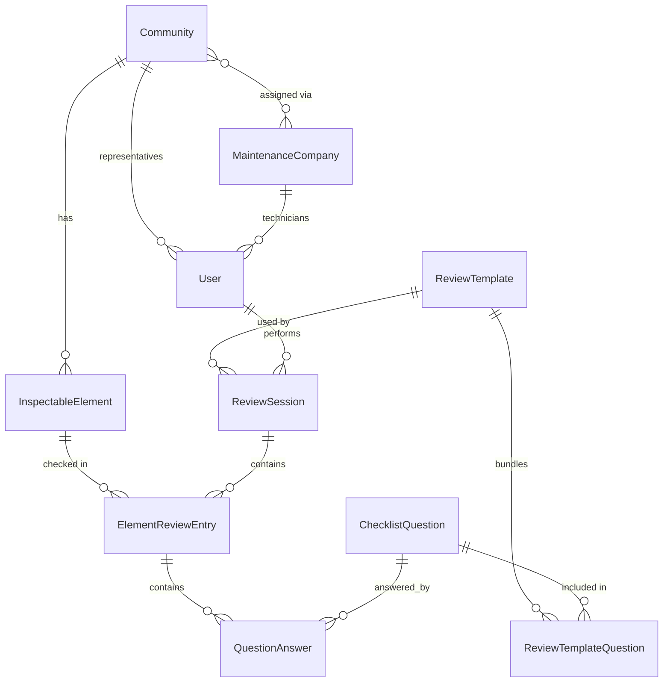

# Domain Model — Inspections

Implements the decisions from [ADR-011](../adr/ADR-011-expanded-roles-and-auth-architecture.md)
(scoped RBAC, supersedes ADR-005) and [ADR-008](../adr/ADR-008-element-type-extensibility-typed-catalog.md)
(typed element catalog). All names are English per
[ADR-007](../adr/ADR-007-i18n-multilanguage-ui-english-codebase.md).

## Overview

The original paper workflow was: one printed form per review visit, with a
single generic checklist for the whole installation. This model replaces
that with a checklist **per physical element**, nested inside a review
session that still carries the same header data the original form had
(community, review type, date).

```
ReviewTemplate (elementType, frequency, name, version, status)
 └── ReviewTemplateQuestion (curated, ordered selection from the ChecklistQuestion pool)

ReviewSession (community, template, date, performedBy)
 └── ElementReviewEntry (one per physical element checked)
      └── QuestionAnswer (one per templated question, YES/NO/NA)
```

Field workflow: open a `ReviewSession` against a community's currently
`active` `ReviewTemplate` for an element type, scan an element's `code` to
resolve it and create its `ElementReviewEntry`, answer that element's
questions (from the template), then scan the next element. No new entity
needed for the scan-and-answer loop — it's just the order
`ElementReviewEntry` records get created within a session.

`ChecklistQuestion` is a **pool of available questions**; `ReviewTemplate`
is what actually determines what gets asked in a given review — see below
for why this split exists.

## Conventions

Every entity's `id` is a **UUIDv7** primary key ([ADR-009](../adr/ADR-009-primary-key-strategy-uuidv7.md))
— internal, never printed or exposed as a scannable identifier.
`InspectableElement.code` (below) is the one exception: a separate, short,
human/QR-facing public identifier, deliberately *not* time-ordered, distinct
from `id` on purpose.

Every **reference/master-data** entity — `Community`, `MaintenanceCompany`,
`User`, `InspectableElement`, `ChecklistQuestion`, `ReviewTemplate`,
`CommunityMaintenanceAssignment` — also has `deletedAt: Date | null`
([ADR-010](../adr/ADR-010-soft-delete-strategy.md)), omitted from the
per-entity field lists below to avoid repeating it six times. This is
separate from any domain-state field an entity already has (e.g.
`InspectableElement.active`). `ReviewSession`/`ElementReviewEntry`/
`QuestionAnswer` deliberately do **not** get `deletedAt` — see ADR-010's
stricter rule for those.

## Entities

### PropertyManagementCompany
Singleton — exactly one per deployment
([ADR-001](../adr/ADR-001-deployment-model-single-instance-per-property-manager.md)),
holding the company's own corporate data used on report headers/branding
([ADR-012](../adr/ADR-012-property-management-company-profile-entity.md)):
`id`, `name`, `legalName`, `taxId`, `address`, `phone`, `email`,
`logoAssetId?` (reference into object storage — the actual file, not a
config value or a DB blob). No `deletedAt` — the row must always exist for
reports to render; not a deletable record. No direct relationships to
other entities (implicitly "the company running this instance," not
foreign-keyed from elsewhere) — omitted from the ER diagram below for that
reason.

### Community
A residential building managed under this installation. `id`, `name`,
`address`, `locale` (default UI language for this community's users),
`contactInfo`.

### MaintenanceCompany
`id`, `name`, `taxId`, `contactInfo`.

> Per [RIPCI Anexo II](../compliance/ripci-extinguisher-maintenance-program.md),
> `ANNUAL`/`QUINQUENNIAL`-tier operations may legally be performed by the
> manufacturer as an alternative to a maintenance company. Not modeled as a
> separate entity — not how this app's actual users work in practice (a
> manufacturer servicing a residential community directly is an edge case,
> not the norm); revisit if it ever comes up for real.

### CommunityMaintenanceAssignment
Join entity. `communityId`, `maintenanceCompanyId`, `active`. A maintenance
company's technicians get their access scope (ADR-005) from the set of
communities assigned here.
> Open question: should an assignment be scoped to specific element types
> (e.g. company X only maintains extinguishers, company Y handles BIEs)?
> Not decided — starting without that granularity, revisit if needed.

### User
`id`, `name`, `email`, `passwordHash`, `role` (`SYSTEM_ADMIN` | `MANAGER` |
`MAINTENANCE_COMPANY_MANAGER` | `MAINTENANCE_TECHNICIAN` |
`COMMUNITY_REPRESENTATIVE` — [ADR-011](../adr/ADR-011-expanded-roles-and-auth-architecture.md)),
`locale`, plus role-dependent fields:
- `SYSTEM_ADMIN` — no extra field, scope is global, unrestricted.
- `MANAGER` — `managerCapabilities` (set of `MANAGE_COMMUNITIES` |
  `MANAGE_MAINTENANCE_COMPANIES` | `MANAGE_CHECKLIST_CONTENT` |
  `MANAGE_INSPECTABLE_ELEMENTS` | `VIEW_ALL_REVIEWS`) — user management
  is deliberately not an assignable capability, `SYSTEM_ADMIN`-only.
- `MAINTENANCE_COMPANY_MANAGER` — `maintenanceCompanyId` (fixed scope).
  CRUD over that company's `MAINTENANCE_TECHNICIAN` users, read access to
  every review performed by any of them.
- `MAINTENANCE_TECHNICIAN` — `maintenanceCompanyId` (scope for
  *performing* reviews resolved dynamically via
  `CommunityMaintenanceAssignment`); review **visibility** is narrower —
  only sessions where `performedById = self`.
- `COMMUNITY_REPRESENTATIVE` — `communityId` (fixed scope). This is a
  resident designated by the community (owner/occupant of record,
  president, vice-president...) on record as responsible in the
  community's meeting minutes — not a property management company
  employee.

### ElementType (code-level enum, ADR-008)
`EXTINGUISHER` today; `BIE`, `EMERGENCY_LIGHTING`, `FIRE_DOOR`, ... added by
development as needed. Not a database table — a TypeScript discriminated
union, so each type's detail attributes stay strongly typed.

### InspectableElement
Base fields shared by every element type: `id`, `communityId`,
`elementType`, `name`, `description?`, `location` (free text, e.g. "planta
baja, pasillo"), `imageUrl?`, `installedAt`, `active` (decommissioned
elements keep their history but stop appearing in new reviews).

**Identification**: the field workflow is scan → identify element → answer
its questions → move to the next element. The manufacturer's serial number
is unreliable for this (often hard to locate/read on the physical unit), so
identification is driven by an **app-generated `code`** instead:
- `code`: a short (10-character), random, non-sequential public identifier
  generated by the app when the element is registered — **not** the raw
  `id` UUID. Uses an alphabet that excludes visually ambiguous characters
  (no `0`/`O`, `1`/`I`/`L`), since it must also work as a manual fallback
  someone reads and types by hand off a printed label. Unique across the
  whole installation (app-generated, so global uniqueness is trivial and
  avoids ambiguity if an element is ever reassigned between communities).
  Rendered as a QR code encoding a URL (`.../elements/{code}`), with the
  `code` also printed as plain text under the QR for the manual fallback.
  Scanning on mobile deep-links straight to that element's review screen;
  on web (no native camera) the same code works as a manually
  entered/pasted lookup value.
- `serialNumber?`: kept as **informational only** for now — not used for
  lookup, not enforced unique. May become a real identifier later if
  needed.

**`lastInspectedAt` is intentionally not a stored field** — it's derived by
querying the most recent `ElementReviewEntry` for that element. Storing it
denormalized would risk drifting from the actual history for no benefit at
this scale; revisit only if read performance ever requires a cached
projection.

**Hydrostatic test** (quinquennial pressure retest — RIPCI's own term is
"retimbrado", but the regulation itself glosses it as the hydraulic/
hydrostatic pressure test verifying structural integrity; naming the field
in English per the project's naming convention, see
[compliance doc](../compliance/ripci-extinguisher-maintenance-program.md))
is tracked on `InspectableElement` directly, since it's a per-element clock,
not a community-scheduled `ReviewSession`:
- `lastHydrostaticTestAt?`: date of the most recent test.
- `hydrostaticTestCount`: how many times it's been done (default 0).

The 5-year interval and the 3-test cap are **not** stored fields — they're
fixed by the Reglamento de Equipos a Presión (RD 809/2021), so they live as
code-level constants, same reasoning as `ElementType`/`ReviewFrequency`
(ADR-008): regulation-defined constants, not per-record configuration.
`hydrostaticTestCount >= 3` is a business-rule signal that the extinguisher
is due for retirement rather than another test — computed from the
constant, not stored as a flag.

Type-specific details, one shape per `ElementType` (illustrative, refined
when each type is actually implemented):
- `ExtinguisherDetails`: `weightKg`, `agentType`
  (`POWDER`/`CO2`/`FOAM`/`WATER`), `efficacyRating`.
- Other types: not yet designed — added when first needed.

### ReviewFrequency (code-level enum, ADR-008)
`MONTHLY` | `QUARTERLY` | `SEMIANNUAL` | `ANNUAL` (M/T/S/A from the
original form).

### ChecklistQuestion
The **pool** of available questions an admin can draw from — not, by
itself, what gets asked in any given review (see `ReviewTemplate`).
`id`, `elementType`, `frequencies` (**set** of `ReviewFrequency` — an
informational tag used to suggest candidate questions when building a
template for a given frequency; RIPCI's own tables show checks shared
between periodicities, so a question can be tagged for more than one),
`text` (i18n key), `active` (retire without deleting history).

For `EXTINGUISHER` + `QUARTERLY`, the actual question set is sourced from
RIPCI Anexo II Tabla I — see the
[compliance doc](../compliance/ripci-extinguisher-maintenance-program.md)
for the cited list. For `EXTINGUISHER` + `ANNUAL`, RIPCI itself defers to
UNE 23120 (not public) — **the maintenance company provides the actual
question set** their technicians need answered for the review to be valid
and certifiable by them.

### ReviewTemplate

**Why this entity exists**: with only `ChecklistQuestion` (queried live by
`elementType` + `frequency` at review time), there's no explicit record of
"exactly which questions constituted the quarterly review in March 2026"
versus now — it has to be reconstructed indirectly from old
`QuestionAnswer` rows. For a RIPCI-regulated, 5-year-retention domain, that
indirection is a weaker audit posture than it needs to be. A
`ReviewTemplate` makes "what was asked, as of when" an explicit, named,
versioned, immutable-once-used object instead.

A named, versioned, curated bundle of questions — the actual repository of
report templates ("revisión trimestral", "revisión anual") the admin
manages. `id`, `elementType`, `frequency`, `name`, `version` (integer,
starting at 1, incrementing per `(elementType, frequency)` lineage),
`status` (`draft` | `active` | `retired`), `createdAt`, `deletedAt`
(ADR-010 — for a template created by mistake and never used; a normal
version supersession uses `retired`, not `deletedAt`, since retired
templates stay fully visible for historical sessions that reference them).

Only one `active` template per `(elementType, frequency)` at a time.
Creating a new version (selecting questions from the `ChecklistQuestion`
pool) and activating it automatically retires the previous one — retiring
does not touch any `ReviewSession` that already references it.

### ReviewTemplateQuestion
Join entity: the curated, ordered selection for one template version.
`id`, `templateId`, `questionId`, `order`.

### ReviewSession
One review visit. `id`, `communityId`, `templateId`, `date`,
`performedById` (User), `status` (`draft` | `completed` | `signed`).
`elementType`/`frequency` are derived from the referenced `ReviewTemplate`,
not duplicated as separate fields — the template is the single source of
truth for both "what kind of review this is" and "what questions apply."
Scoped to a single template per session — mirrors the original
one-document-per-review-type structure. Covers every active
`InspectableElement` of that `elementType` in the community.

**Immutable once finalized** ([ADR-010](../adr/ADR-010-soft-delete-strategy.md)):
a `ReviewSession` with `status != draft`, and its `ElementReviewEntry`/
`QuestionAnswer` children, cannot be deleted — soft or hard — by any role,
enforced at the domain layer. Only `draft` sessions may be hard-deleted.
This protects RIPCI's 5-year documentary retention minimum.

**Review scheduling policy** (verified against
[RIPCI Anexo II](../compliance/ripci-extinguisher-maintenance-program.md)):
- Every calendar quarter needs exactly one `ReviewSession` per
  `(community, elementType)` — no gaps.
- Which quarter uses an `ANNUAL`-frequency template (vs `QUARTERLY`) is
  **not fixed** to a particular quarter — it shifts year to year based on
  the maintenance company's actual availability.
- The only hard constraint: the gap between two consecutive
  `ANNUAL`-frequency sessions for the same `(community, elementType)` must
  not exceed 12 months. There is **no minimum** — a community could, in
  principle, have every quarter done by a technician if no resident takes
  on the representative role. The 12-month clock resets from the actual
  date of the last `ANNUAL` session, not from any originally-expected
  quarter.
- This is application-layer logic (a scheduling/compliance-calendar domain
  service reading a community's `ReviewSession` history), not new persisted
  state — needed for FR-007 (creating a session should know what's
  expected/due) and FR-009 (overdue/upcoming reminders).

### ElementReviewEntry
`id`, `reviewSessionId`, `inspectableElementId`. One row per physical
element checked in that session.

### QuestionAnswer
`id`, `elementReviewEntryId`, `questionId`, `answer`
(`YES` | `NO` | `NOT_APPLICABLE`).

## Entity relationships



## Open questions

- Maintenance-company assignment granularity by element type (see above).
- Whether `ReviewSession` should ever cover more than one `elementType` in
  a single visit — current design keeps it single-type for fidelity to the
  original per-review-type document; revisit if it becomes friction in
  practice.
- Exact `ExtinguisherDetails` fields — placeholder until the extinguisher
  slice is actually implemented.
- The hydrostatic test is tracked but has no workflow yet (who records
  `lastHydrostaticTestAt`, from where) — deferred, see compliance doc.
- If a `ChecklistQuestion`'s *text* changes (not just which questions are
  bundled), should that force a new template version too, or edit the
  question in place (which would retroactively change the wording shown
  for old, already-answered sessions referencing it)? Not decided — the
  template versioning above solves "which questions changed", not "a
  question's wording changed."
