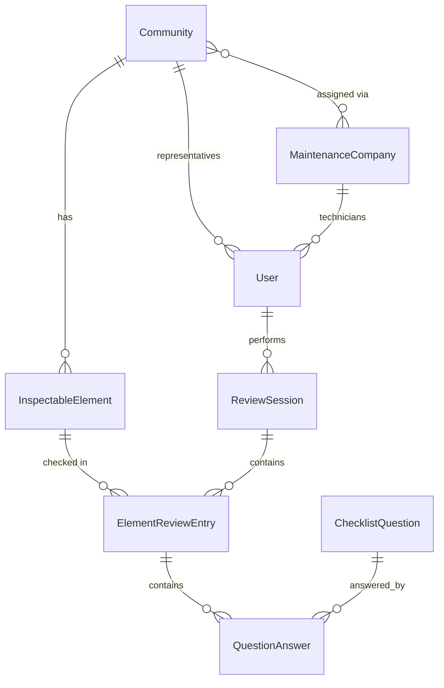

# Domain Model — Inspections

Implements the decisions from [ADR-005](../adr/ADR-005-authorization-model-scoped-rbac.md)
(scoped RBAC) and [ADR-008](../adr/ADR-008-element-type-extensibility-typed-catalog.md)
(typed element catalog). All names are English per
[ADR-007](../adr/ADR-007-i18n-multilanguage-ui-english-codebase.md).

## Overview

The original paper workflow was: one printed form per review visit, with a
single generic checklist for the whole installation. This model replaces
that with a checklist **per physical element**, nested inside a review
session that still carries the same header data the original form had
(community, review type, date).

```
ReviewSession (community, elementType, frequency, date, performedBy)
 └── ElementReviewEntry (one per physical element checked)
      └── QuestionAnswer (one per checklist question, YES/NO/NA)
```

Field workflow: open a `ReviewSession` for a community + element type, scan
an element's `code` to resolve it and create its `ElementReviewEntry`,
answer that element's `ChecklistQuestion`s, then scan the next element. No
new entity needed for this — it's just the order `ElementReviewEntry`
records get created within a session.

## Entities

### Community
`comunidad de vecinos`. `id`, `name`, `address`, `locale` (default UI
language for this community's users), `contactInfo`.

### MaintenanceCompany
`empresa de mantenimiento`. `id`, `name`, `taxId`, `contactInfo`.

### CommunityMaintenanceAssignment
Join entity. `communityId`, `maintenanceCompanyId`, `active`. A maintenance
company's technicians get their access scope (ADR-005) from the set of
communities assigned here.
> Open question: should an assignment be scoped to specific element types
> (e.g. company X only maintains extinguishers, company Y handles BIEs)?
> Not decided — starting without that granularity, revisit if needed.

### User
`id`, `name`, `email`, `passwordHash`, `role` (`ADMIN` |
`COMMUNITY_REPRESENTATIVE` | `MAINTENANCE_TECHNICIAN`), `locale`, plus
role-dependent scope:
- `ADMIN` — no extra field, scope is global (ADR-005).
- `COMMUNITY_REPRESENTATIVE` — `communityId` (fixed scope).
- `MAINTENANCE_TECHNICIAN` — `maintenanceCompanyId` (scope resolved
  dynamically via `CommunityMaintenanceAssignment`).

### ElementType (code-level enum, ADR-008)
`EXTINGUISHER` today; `BIE`, `EMERGENCY_LIGHTING`, `FIRE_DOOR`, ... added by
development as needed. Not a database table — a TypeScript discriminated
union, so each type's detail attributes stay strongly typed.

### InspectableElement
Base fields shared by every element type: `id`, `communityId`,
`elementType`, `name`, `description?`, `location` (free text, e.g. "planta
baja, pasillo"), `imageUrl?`, `installedAt`, `active` (decommissioned
elements keep their history but stop appearing in new reviews).

**Identification**: the field workflow is scan → identify element → answer
its questions → move to the next element. The manufacturer's serial number
is unreliable for this (often hard to locate/read on the physical unit), so
identification is driven by an **app-generated `code`** instead:
- `code`: a QR code generated by the app when the element is registered,
  unique across the whole installation (not just within a community — it's
  app-generated, so global uniqueness is trivial and avoids ambiguity if an
  element is ever reassigned between communities). Encodes a URL
  (`.../elements/{code}`) so scanning on mobile deep-links straight to that
  element's review screen; on web (no native camera) the same code works as
  a manually entered/pasted lookup value.
- `serialNumber?`: kept as **informational only** for now — not used for
  lookup, not enforced unique. May become a real identifier later if
  needed.

**`lastInspectedAt` is intentionally not a stored field** — it's derived by
querying the most recent `ElementReviewEntry` for that element. Storing it
denormalized would risk drifting from the actual history for no benefit at
this scale; revisit only if read performance ever requires a cached
projection.

Type-specific details, one shape per `ElementType` (illustrative, refined
when each type is actually implemented):
- `ExtinguisherDetails`: `weightKg`, `agentType`
  (`POWDER`/`CO2`/`FOAM`/`WATER`), `efficacyRating`.
- Other types: not yet designed — added when first needed.

### ReviewFrequency (code-level enum, ADR-008)
`MONTHLY` | `QUARTERLY` | `SEMIANNUAL` | `ANNUAL` (M/T/S/A from the
original form).

### ChecklistQuestion
The one genuinely admin-configurable catalog ("gestión de preguntas").
`id`, `elementType`, `frequency` (single value — a question belongs to one
frequency, matching the original form's "Tipo" column), `text` (i18n key),
`order`, `active` (retire without deleting history).

### ReviewSession
One review visit. `id`, `communityId`, `elementType`, `frequency`, `date`,
`performedById` (User), `status` (`draft` | `completed` | `signed`).
Scoped to a single element type + frequency per session — mirrors the
original one-document-per-review-type structure. Covers every active
`InspectableElement` of that `elementType` in the community.

### ElementReviewEntry
`id`, `reviewSessionId`, `inspectableElementId`. One row per physical
element checked in that session.

### QuestionAnswer
`id`, `elementReviewEntryId`, `questionId`, `answer`
(`YES` | `NO` | `NOT_APPLICABLE`).

## Entity relationships



## Open questions

- Maintenance-company assignment granularity by element type (see above).
- Whether `ReviewSession` should ever cover more than one `elementType` in
  a single visit — current design keeps it single-type for fidelity to the
  original per-review-type document; revisit if it becomes friction in
  practice.
- Exact `ExtinguisherDetails` fields — placeholder until the extinguisher
  slice is actually implemented.
